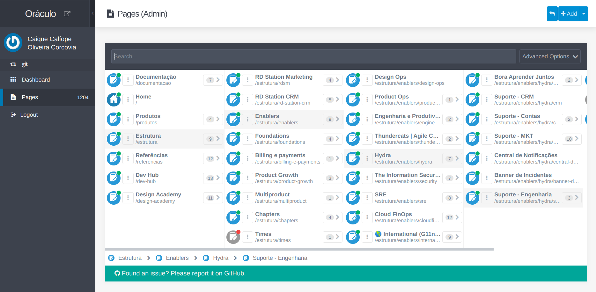

# Introdução a *Markdown language*
Eu acho bem mais fácil do que o editor do Oráculo.

## O editor do Oráculo
Depois de [fazer o login](https://oraculo.rdstation.com.br/) você poderá editar qualquer página clicando em **Editar página**.

---

## Adicionar uma página nova

> “Documentar é legal!”
> 
> *- Caique*
